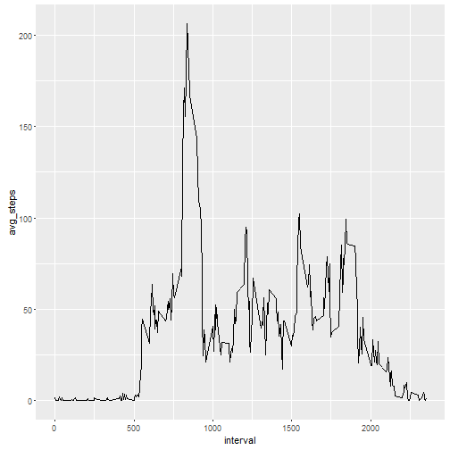
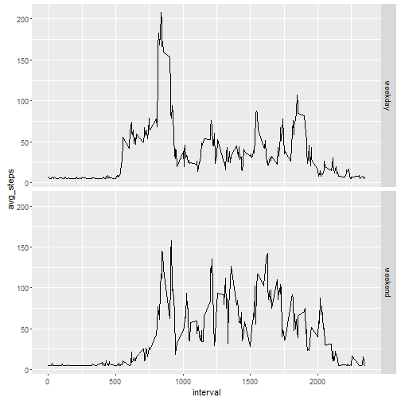

**Load packages**

```r
library(ggplot2)
library(dplyr)
library(mice)
library(Hmisc)
```
#With Missing value
**Load Data**

```r
act <- read.csv("activity.csv")
```
Transform the "date":

```r
act$date <- as.Date(act$date, "%Y-%m-%d")
```

__total number of steps taken per day?__

```r
sum_step <- act %>%
        group_by(date) %>%
        summarise( total_steps = sum(steps))

head(sum_step)
```

```
## # A tibble: 6 x 2
##         date total_steps
##       <date>       <int>
## 1 2012-10-01          NA
## 2 2012-10-02         126
## 3 2012-10-03       11352
## 4 2012-10-04       12116
## 5 2012-10-05       13294
## 6 2012-10-06       15420
```

**histogram of total number of steps taken per day**

```r
ggplot(sum_step, aes(x = total_steps)) + geom_histogram(aes(y = ..density..),bins = 38) + geom_density()
```

```
## Warning: Removed 8 rows containing non-finite values (stat_bin).
```

```
## Warning: Removed 8 rows containing non-finite values (stat_density).
```


**mean and median of the total number of steps taken per day**

```r
mean_step <- act %>%
        group_by(date) %>%
        summarise( avg_daily = mean(steps))
head(mean_step)
```

```
## # A tibble: 6 x 2
##         date avg_daily
##       <date>     <dbl>
## 1 2012-10-01        NA
## 2 2012-10-02   0.43750
## 3 2012-10-03  39.41667
## 4 2012-10-04  42.06944
## 5 2012-10-05  46.15972
## 6 2012-10-06  53.54167
```

```r
median_step <- act %>% 
        group_by(date) %>%
        summarise( med_daily = median(steps))
head(median_step)
```

```
## # A tibble: 6 x 2
##         date med_daily
##       <date>     <dbl>
## 1 2012-10-01        NA
## 2 2012-10-02         0
## 3 2012-10-03         0
## 4 2012-10-04         0
## 5 2012-10-05         0
## 6 2012-10-06         0
```

**Average of daily activities**

```r
time_series <- act %>%
        group_by(interval) %>%
        summarise(avg_steps = mean(steps, na.rm = TRUE))
head(time_series)
```

```
## # A tibble: 6 x 2
##   interval avg_steps
##      <int>     <dbl>
## 1        0 1.7169811
## 2        5 0.3396226
## 3       10 0.1320755
## 4       15 0.1509434
## 5       20 0.0754717
## 6       25 2.0943396
```

```r
ggplot(time_series, aes( x =  interval, y = avg_steps)) + geom_line()
```




**interval having max steps across all the days**

```r
time_series[which(time_series$avg_steps == max(time_series$avg_steps)), ]
```

```
## # A tibble: 1 x 2
##   interval avg_steps
##      <int>     <dbl>
## 1      835  206.1698
```

#Imputing Missing values

**numbers of missing values in the dateset and percentage**

```r
num_miss <- sum(is.na(act$steps))
num_miss
```

```
## [1] 2304
```

```r
perc_miss <- mean(is.na(act$steps))
perc_miss
```

```
## [1] 0.1311475
```

**impute the missing values with "Hmisc"" package**

```r
act_impute <- act

act_impute$steps <- with(act_impute, impute(steps, mean))

head(act_impute)
```

```
##     steps       date interval
## 1 37.3826 2012-10-01        0
## 2 37.3826 2012-10-01        5
## 3 37.3826 2012-10-01       10
## 4 37.3826 2012-10-01       15
## 5 37.3826 2012-10-01       20
## 6 37.3826 2012-10-01       25
```

**histogram of total numbers of steps taken each day**

```r
sum_step_2 <- act_impute %>%
        group_by(date) %>%
        summarise(total_steps = sum(steps))

ggplot(sum_step_2, aes(x = total_steps)) + geom_histogram(aes(y = ..density..),bins = 38) + geom_density()
```


**mean and median of the total number of steps taken per day**

```r
mean_step2 <- act_impute %>%
        group_by(date) %>%
        summarise( avg_steps_daily = mean(steps))

head(mean_step2)
```

```
## # A tibble: 6 x 2
##         date avg_steps_daily
##       <date>           <dbl>
## 1 2012-10-01        37.38260
## 2 2012-10-02         0.43750
## 3 2012-10-03        39.41667
## 4 2012-10-04        42.06944
## 5 2012-10-05        46.15972
## 6 2012-10-06        53.54167
```

```r
median_step2 <- act_impute %>%
        group_by(date) %>%
        summarise( med_steps_daily = median(steps))
head(median_step2)
```

```
## # A tibble: 6 x 2
##         date med_steps_daily
##       <date>           <dbl>
## 1 2012-10-01         37.3826
## 2 2012-10-02          0.0000
## 3 2012-10-03          0.0000
## 4 2012-10-04          0.0000
## 5 2012-10-05          0.0000
## 6 2012-10-06          0.0000
```

##differences between "weekdays" and "weekends"


**create a variable containing 2 levels of factors "weekday" and "weekend"**


```r
act_impute$day <- weekdays(act_impute$date)
act_impute$wkdays <- vector(mode = "character", length = 17568)
for( i in 1:length(act_impute$day)){
        if( act_impute$day[i] == "Saturday" | act_impute$day[i] == "Sunday"){
                act_impute$wkdays[i] <- "weekend"
        } else {
                act_impute$wkdays[i] <- "weekday"
        }        

}

act_impute$wkdays <- as.factor(act_impute$wkdays)
```
**make a plot to compare "weekday" and "weekend" activiies**

```r
act_time_series <- act_impute %>%
        select(steps, interval, wkdays) %>%
        group_by(interval, wkdays) %>%
        mutate(avg_steps = mean(steps))

ggplot(act_time_series, aes(x = interval, y = avg_steps)) + geom_line() + facet_grid(wkdays~.)
```




